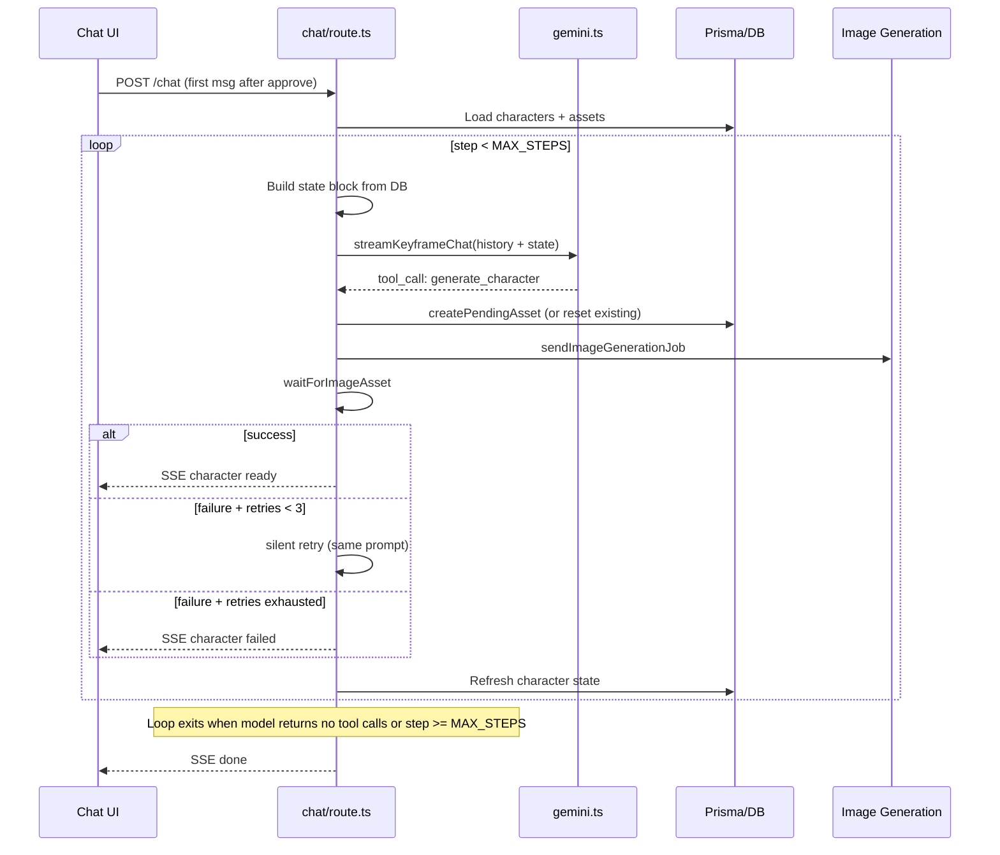

# Character Agent Loop with Versioning

## Overview

Add an agentic multi-turn character generation loop to the keyframe phase. On first entry after approve, the model iterates over tool calls with DB-refreshed state context, silent retries on failure, and character versioning with a UI version picker.

## Architecture



## Key design decisions

- **Agent loop only on first entry** after approve (`isFirstKeyframeMessage`). Subsequent user messages use existing single-turn flow.
- **Silent retries**: on image generation failure, retry the same prompt up to 3 times before reporting failure. No new version for retries.
- **State block rebuilt from DB** each iteration -- the model sees only current state, not history of state changes.
- **Loop exit**: model returns no tool calls (all characters ready) or `step >= MAX_STEPS` (safety cap, e.g. 20).
- **Character versioning**: regeneration creates a new `Asset` row with incremented `version`, grouped by `groupKey`. User selects preferred version via a modal.
- **Auto-trigger**: after approve, the client auto-sends a bootstrap message to start the loop without manual typing.

---

## Implementation tasks

### 1. Prisma schema: add `groupKey` and `selected` to Asset

**File:** `prisma/schema.prisma`

Add two nullable columns to `Asset`:

```prisma
groupKey  String?
selected  Boolean  @default(false)
```

- `groupKey`: stable identifier shared across all versions of a character (e.g. `"barista"`, `"the-mom"`). Null for non-character assets.
- `selected`: marks the user's chosen version within a group.

Run `prisma db push` after.

### 2. Session service: new helpers for character versioning

**File:** `src/server/services/session.ts`

Add five new functions:

- **`getCharacterGroups(sessionId)`** -- query all `kind: "character"` assets grouped by `groupKey`, ordered by `version` desc. Returns a map of `groupKey -> Asset[]`.
- **`createCharacterVersion(sessionId, groupKey, prompt, meta)`** -- find max `version` for that `groupKey`, create new asset with `version + 1`, `generationStatus: "pending"`.
- **`resetAssetForRetry(assetId)`** -- set `generationStatus` back to `"pending"`, clear `generationError` and `uri`. Used for silent retries on the same asset row.
- **`selectCharacterVersion(groupKey, sessionId, assetId)`** -- unselect all assets with same `groupKey` in session, select the target asset.
- **`getSelectedCharacters(sessionId)`** -- return the `selected` (or latest) version of each character group. Used by keyframe generation to pick which character references to use.

### 3. Build pipeline state block

**File:** `src/server/services/gemini.ts`

New exported function: **`buildCharacterStateBlock(characters)`**

Takes output of `getCharacterGroups` and formats a compact string:

```
== Pipeline State (authoritative) ==
Characters:
- [groupKey: "barista", id: "clxyz...", version: 1] "The Barista" -- ready (uri: http://...)
- [groupKey: "protagonist", id: "clabc...", version: 1] "Protagonist" -- failed (error: content policy)
- [groupKey: "kid", id: null] "The Kid" -- not_started
```

Only shows the latest version of each group. The model uses `groupKey` to reference characters.

Update `KEYFRAME_SYSTEM_PROMPT` to add these instructions:
- When creating a new character, omit `id` from the tool call.
- When regenerating an existing character, pass the `id` of the character to replace.
- The state block is authoritative -- do not generate characters already marked `ready` unless explicitly asked by the user.

### 4. Update `generate_character` tool schema

**File:** `src/server/services/gemini.ts`

Add optional `id` parameter to `GENERATE_CHARACTER_TOOL`:

```typescript
id: {
  type: "string",
  description: "Existing character asset ID. If provided, creates a new version of this character instead of a new character.",
},
```

Update `KEYFRAME_TOOLS_GEMINI` accordingly (it mirrors the same schema).

### 5. Extract tool execution into shared helper

**File:** `src/app/api/sessions/[id]/chat/route.ts`

Extract the duplicated character tool execution block (~80 lines) into:

**`executeCharacterTool(controller, sessionId, args, retryCounts)`**

Handles:
- `createPendingAsset` (new character) or `createCharacterVersion` (regeneration, when `args.id` is provided)
- `sendImageGenerationJob`
- `waitForImageAsset`
- Silent retries: on failure, if `retryCounts[groupKey] < MAX_RETRIES`, call `resetAssetForRetry`, re-queue the same prompt, increment retry count
- SSE events for pending/ready/failed states

Returns `{ groupKey, success, fullResponseChunk }`.

Used in both the agent loop and the single-turn path.

### 6. Refactor `handleKeyframeChat` into an agent loop

**File:** `src/app/api/sessions/[id]/chat/route.ts`

Replace the single-pass `for await (const event of streamKeyframeChat(...))` with a multi-turn loop, **only on first entry** (`isFirstKeyframeMessage`). Subsequent user messages continue to use the existing single-turn flow.

Pseudocode for the loop inside `ReadableStream.start()`:

```
const MAX_STEPS = 20;
const MAX_RETRIES = 3;
const retryCounts: Record<string, number> = {};
let step = 0;

while (step < MAX_STEPS) {
  // 1. Refresh state from DB
  const charGroups = await getCharacterGroups(id);
  const stateBlock = buildCharacterStateBlock(charGroups);

  // 2. Build history with state injected as latest user context
  const freshHistory = getGeminiHistory(...);
  const messageWithState = contextMessage + "\n\n" + stateBlock;

  // 3. Call model
  let hadToolCall = false;
  for await (const event of streamKeyframeChat(freshHistory, messageWithState)) {
    if (event.type === "text") { ... stream to client ... }
    if (event.type === "tool_call" && event.name === "generate_character") {
      hadToolCall = true;
      // call executeCharacterTool(controller, id, args, retryCounts)
    }
  }

  // 4. Save assistant response, update history
  if (fullResponse) await addMessage(id, "assistant", fullResponse);

  // 5. Exit conditions
  if (!hadToolCall) break;  // model decided it's done
  step++;
}
```

Key details:
- On each iteration, state is rebuilt from DB, not carried forward in memory.
- Silent retries happen within `executeCharacterTool` (retry the image job up to 3 times before reporting failure), not as separate loop iterations.
- After the loop, stream `{ done: true }`.

### 7. Client: group characters by `groupKey`, version picker modal

**File:** `src/app/chat/[id]/page.tsx`

**Type changes:**
- `CharacterAsset` type gets `groupKey: string`, `version: number`, `selected: boolean` fields.
- Derive `characterGroups` (grouped by `groupKey`) from the flat `characters` array for display.

**Characters tab changes:**
- Each card shows the **selected** (or latest) version's image.
- If a character group has > 1 versions, show a small version badge (e.g. "v2 of 3").
- Clicking a multi-version character opens a **modal** showing all versions as a horizontal strip. User clicks one to select it.

**SSE handling changes:**
- `character` SSE payloads now include `groupKey` and `version`.
- On receive, upsert into the correct group rather than appending blindly.

### 8. New API route: character version selection

**File:** `src/app/api/sessions/[id]/characters/[groupKey]/select/route.ts`

POST route accepting `{ assetId }` in the body. Calls `selectCharacterVersion(groupKey, sessionId, assetId)`.

### 9. Auto-trigger on approve

**File:** `src/app/chat/[id]/page.tsx`

In `handleApprove`, after `setStatus("script_approved")`, auto-call `send()` with a bootstrap message like `"Begin generating character reference images."` so the user doesn't have to manually type anything to start the loop.

---

## File change summary

| File | Change type |
|------|-------------|
| `prisma/schema.prisma` | Modify -- add `groupKey`, `selected` columns |
| `src/server/services/session.ts` | Modify -- add 5 new functions |
| `src/server/services/gemini.ts` | Modify -- state block builder, prompt update, tool schema update |
| `src/app/api/sessions/[id]/chat/route.ts` | Modify -- extract helper, agent loop |
| `src/app/api/sessions/[id]/characters/[groupKey]/select/route.ts` | Create -- version selection endpoint |
| `src/app/chat/[id]/page.tsx` | Modify -- grouping, version modal, auto-trigger |
