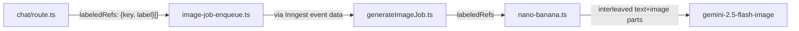

# Labeled Character References for Keyframe Generation

Thread labeled character references (name + image key pairs) through the image generation pipeline so Nano Banana receives interleaved text labels and image blobs, enabling Gemini to associate each reference image with the correct character in keyframe generation.

## Data flow



## 1. Add `labeledRefs` to `ImageGenerateEventData`

**File:** `src/inngest/functions/generateImageJob.ts`

Add an optional field alongside `referenceKeys`:

```typescript
export type ImageGenerateEventData = {
  assetId: string;
  sessionId: string;
  prompt: string;
  referenceKeys?: string[];
  labeledRefs?: { key: string; label: string }[];
};
```

Keep `referenceKeys` for backward compat (product image, unlabeled refs). Pass `labeledRefs` through to `generateImage`.

## 2. Update `generateImage` to accept labeled refs

**File:** `src/server/services/nano-banana.ts`

Add optional `labeledRefs` parameter. When present, interleave text label + image part:

```typescript
export async function generateImage(
  prompt: string,
  sessionId: string,
  referenceKeys?: string[],
  labeledRefs?: { key: string; label: string }[],
): Promise<GeneratedImage> {
```

Build `contents` array:
- `{ text: prompt }` first
- For each `labeledRefs` entry: `{ text: "Reference image for character '${label}':" }` then `objectToInlinePart(key)`
- For each bare `referenceKeys` entry: `objectToInlinePart(key)` (product image etc.)

## 3. Update `sendImageGenerationJob` inline fallback

**File:** `src/server/services/image-job-enqueue.ts`

Pass `data.labeledRefs` through to the `generateImage` fallback call:

```typescript
const result = await generateImage(data.prompt, data.sessionId, data.referenceKeys, data.labeledRefs);
```

## 4. Update Inngest job to pass `labeledRefs`

**File:** `src/inngest/functions/generateImageJob.ts`

Destructure `labeledRefs` from `event.data` and pass to `generateImage`.

## 5. Build labeled refs in the chat route keyframe handler

**File:** `src/app/api/sessions/[id]/chat/route.ts`

In the keyframe tool execution blocks (both agent loop and single-turn), when resolving `characterIds`:
- Instead of pushing bare keys to `refKeys`, build a `labeledRefs` array
- Look up each character asset, extract the key from its URI and the name from its `meta` JSON
- Pass `labeledRefs` alongside `referenceKeys` (which keeps product image as an unlabeled ref) to `sendImageGenerationJob`

Current code (line ~242):
```typescript
const refKeys: string[] = [];
if (args.characterIds?.length) {
  const charAssets = await getAssetsByKind(id, "character");
  for (const charId of args.characterIds) {
    const match = charAssets.find((a) => a.id === charId);
    if (match?.generationStatus === "ready" && match.uri) {
      refKeys.push(extractKeyFromUri(match.uri));
    }
  }
}
```

Becomes:
```typescript
const labeledRefs: { key: string; label: string }[] = [];
const refKeys: string[] = [];
if (args.characterIds?.length) {
  const charAssets = await getAssetsByKind(id, "character");
  for (const charId of args.characterIds) {
    const match = charAssets.find((a) => a.id === charId);
    if (match?.generationStatus === "ready" && match.uri) {
      const name = match.meta ? JSON.parse(match.meta).name : "Character";
      labeledRefs.push({ key: extractKeyFromUri(match.uri), label: name });
    }
  }
}
// product image stays in refKeys (unlabeled)
```

Then pass both:
```typescript
await sendImageGenerationJob({
  assetId: asset.id,
  sessionId: id,
  prompt: args.visualPrompt,
  referenceKeys: refKeys.length > 0 ? refKeys : undefined,
  labeledRefs: labeledRefs.length > 0 ? labeledRefs : undefined,
});
```

This change applies to both the agent loop block and the single-turn block (duplicated keyframe handling).

## Files changed

- `src/inngest/functions/generateImageJob.ts` — add `labeledRefs` to type + pass through
- `src/server/services/nano-banana.ts` — accept `labeledRefs`, interleave text+image parts
- `src/server/services/image-job-enqueue.ts` — pass `labeledRefs` in fallback
- `src/app/api/sessions/[id]/chat/route.ts` — build labeled refs from character metadata
